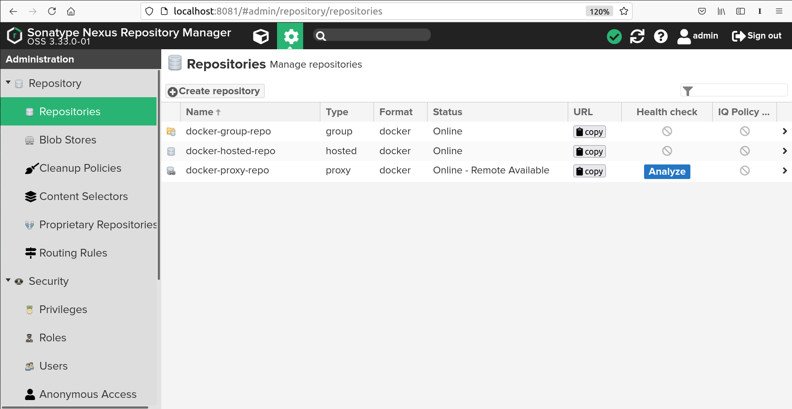
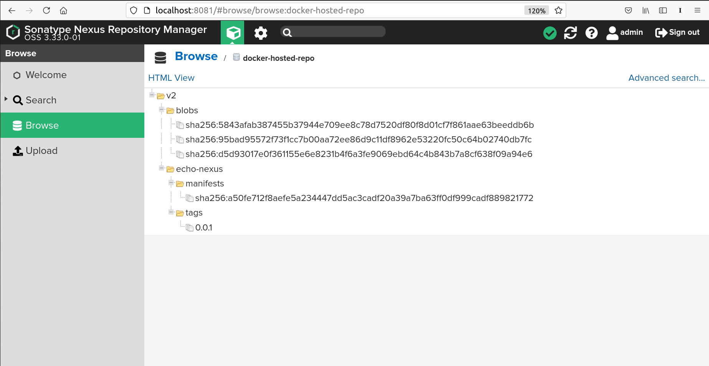

### docker-compose.yml  
```  
version: "3.9"

services:
  nexus:
    image: sonatype/nexus3:3.33.0
    restart: always
    ports:
      - 8081:8081  # nexus
      - 8082:8082  # hosted
      - 8083:8083  # group
    volumes:
      - ./nexus-data:/nexus-data  
```  

<br>  

### Docker repos:  
  

<br>  

### Dockerfile:  
```  
FROM alpine:3.14.0
RUN echo "nexus" > nexus.txt  
```  

<br>  

### Docker build & push to localhost:8082:  
```  
user@host docker build -t localhost:8082/echo-nexus:0.0.1 .  
```  
```  
user@host docker login localhost:8082  
```  
```  
Username: admin
Password: 
WARNING! Your password will be stored unencrypted in /home/alex000/.docker/config.json.
Configure a credential helper to remove this warning. See
https://docs.docker.com/engine/reference/commandline/login/#credentials-store

Login Succeeded  
```  
```  
user@host docker push localhost:8082/echo-nexus:0.0.1  
```  
```  
The push refers to repository [localhost:8082/echo-nexus]
4e27737da9c4: Pushed 
72e830a4dff5: Pushed 
0.0.1: digest: sha256:a50fe712f8aefe5a234447dd5ac3cadf20a39a7ba63ff0df999cadf889821772 size: 735  
```  

<div style="page-break-after: always; visibility: hidden"> 
\pagebreak 
</div>  

### Docker hosted repo after push:  
  

<br>  

### Check (pull from localhost:8083):  
```  
user@host docker system prune -af  
```  
```  
user@host docker run localhost:8083/echo-nexus:0.0.1  
```  
```  
Unable to find image 'localhost:8083/echo-nexus:0.0.1' locally
0.0.1: Pulling from echo-nexus
5843afab3874: Pull complete 
95bad95572f7: Pull complete 
Digest: sha256:a50fe712f8aefe5a234447dd5ac3cadf20a39a7ba63ff0df999cadf889821772
Status: Downloaded newer image for localhost:8083/echo-nexus:0.0.1  
```  
